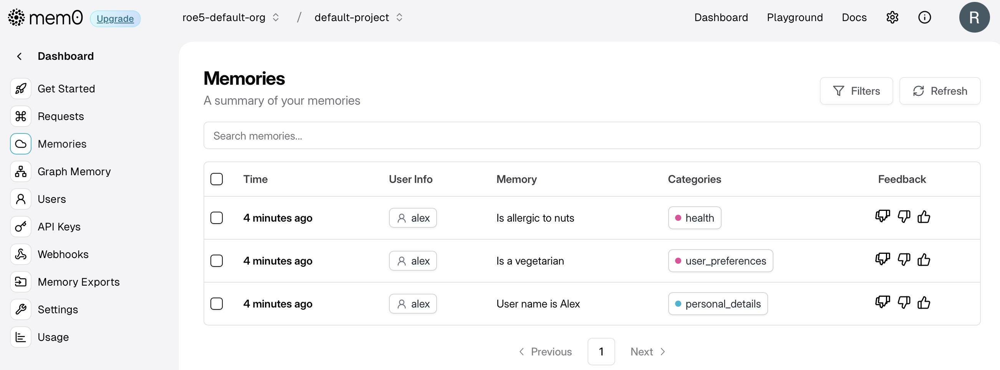

## Going through the basic Mem0 Getting Started
- Results in the 'basic' folder
- Logged in to Mem0 console as roe.mccune
- Installed the SDK, set up an API key, wrote basic.py according to the instructions
- Example was a little clunky and gave me a deprecation warning on the mem0 Utils package
    - Passed in ""Hi, I'm Alex. I'm a vegetarian and I'm allergic to nuts."
    - Retreived a memory:

```
[
    {
        "id": "9f4824ef-1c63-491f-80ff-811b36ae93c0",
        "memory": "Is a vegetarian",
        "user_id": "alex",
        "metadata": null,
        "categories": [
            "user_preferences"
        ],
        "created_at": "2025-08-15T06:59:39.529598-07:00",
        "updated_at": "2025-08-15T06:59:39.548247-07:00",
        "expiration_date": null,
        "structured_attributes": {
            "day": 15,
            "hour": 13,
            "year": 2025,
            "month": 8,
            "minute": 59,
            "quarter": 3,
            "is_weekend": false,
            "day_of_week": "friday",
            "day_of_year": 227,
            "week_of_year": 33
        },
        "score": 0.30164017657754694
    }
]
```
Console now shows:
