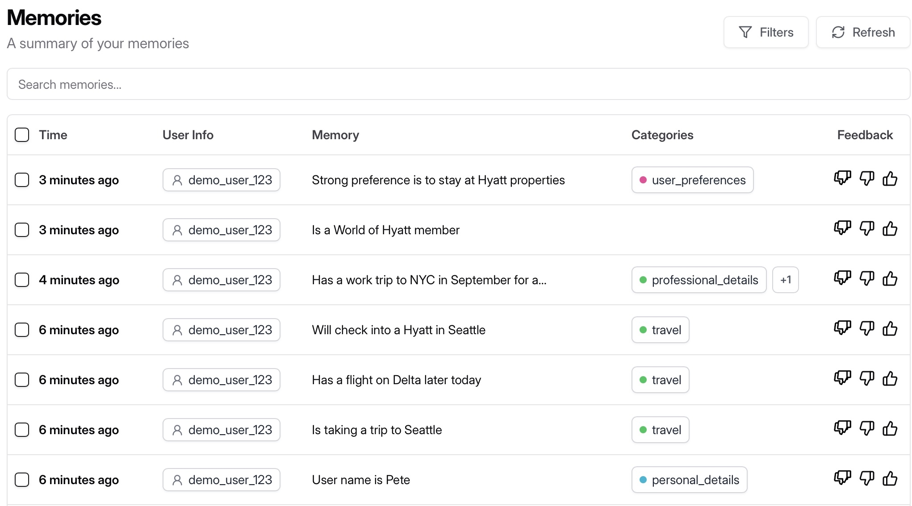
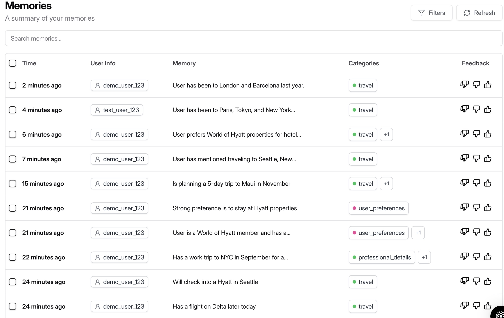
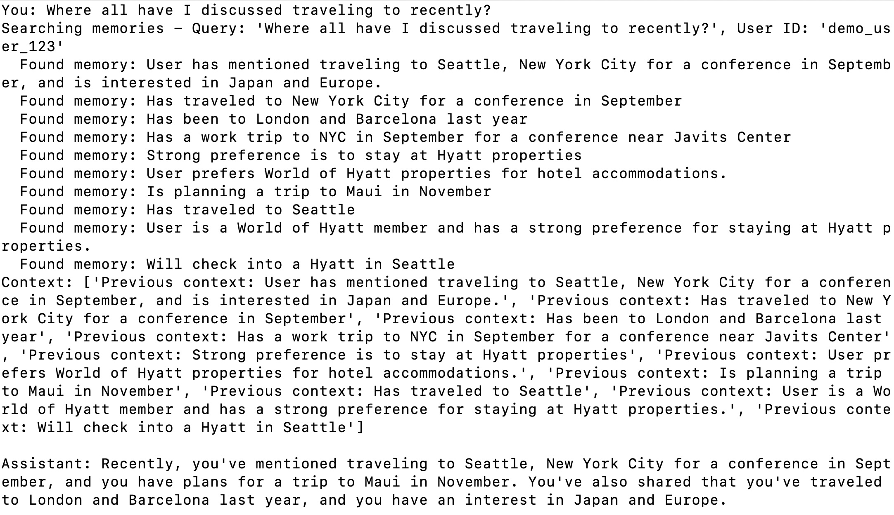
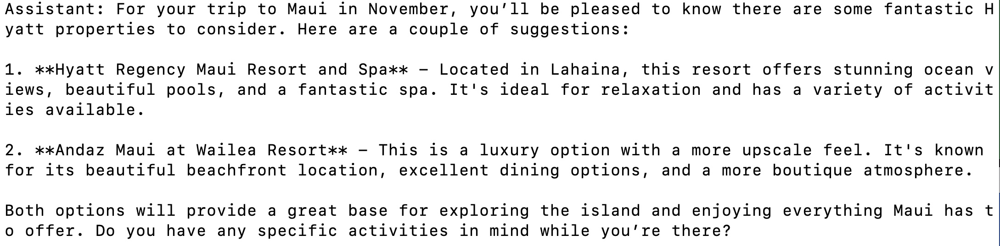
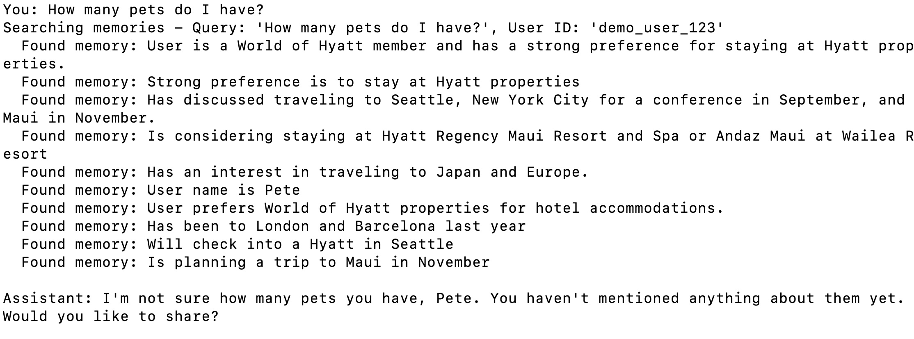
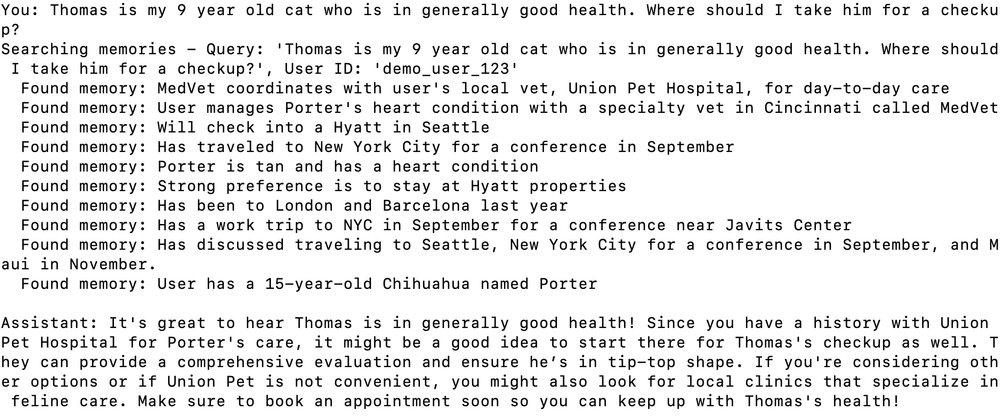

## Going through the basic Mem0 Getting Started
- Results in the 'basic' folder
- Logged in to Mem0 console as roe.mccune
- Installed the SDK, set up an API key, wrote basic.py according to the instructions
- Example was a little clunky and gave me a deprecation warning on the mem0 Utils package
    - Passed in ""Hi, I'm Alex. I'm a vegetarian and I'm allergic to nuts."
    - Retreived a memory:

```
[
    {
        "id": "9f4824ef-1c63-491f-80ff-811b36ae93c0",
        "memory": "Is a vegetarian",
        "user_id": "alex",
        "metadata": null,
        "categories": [
            "user_preferences"
        ],
        "created_at": "2025-08-15T06:59:39.529598-07:00",
        "updated_at": "2025-08-15T06:59:39.548247-07:00",
        "expiration_date": null,
        "structured_attributes": {
            "day": 15,
            "hour": 13,
            "year": 2025,
            "month": 8,
            "minute": 59,
            "quarter": 3,
            "is_weekend": false,
            "day_of_week": "friday",
            "day_of_year": 227,
            "week_of_year": 33
        },
        "score": 0.30164017657754694
    }
]
```
Console now shows:


## Langchain example
- Had claude code build an example based on https://docs.mem0.ai/integrations/langchain
- Resulting one file test is in 'langchain'
- I told it about our trip to Seattle: "Hello, I'm Pete. I'm taking a trip to Seattle and have a flight on Delta later today. We'll also check into a Hyatt. What should I do in Seattle tomorrow?"
    - It made some recommendations
- I then told it about my NYC trip hoping it would pick up on Hyatt but it didn't
- I then told it I was a World of Hyatt member with a strong preference for staying at those properties
- Here's what the memory looks like after that exchange:



- Interesting how it categorized the session.
- I then restared and asked it about a Maui itinerary in November for 5 days.
- Seems like my code is wrong, having Claude Code fix
    - The Mem0 console shows an accounting of my calls and correct results
- Claude Code fixed, it got mixed up on the return type for the memories

When the console shows:



My result shows:



And now when I ask about Maui, it only shows me Hyatt properties:



If I completely change topic:



The query into the memory store doesn't improve. It still returns everything about travel as before.

Let me tell it more about Porter and then ask about Tom:



So, yeah, it gives me the right answer and pulled the right memory information about Porter, but it added extraneous information into the context window about travel that wasn't necessary.