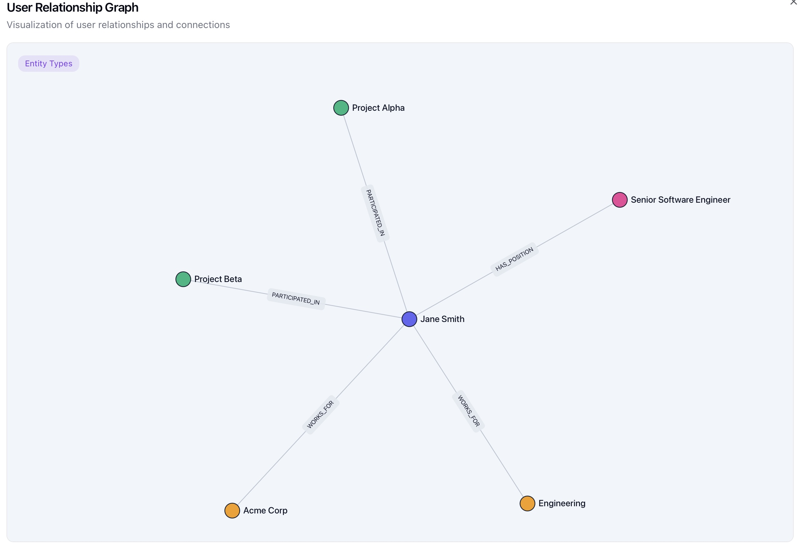

## Going through the basic Zep Getting Started
- A mix of https://help.getzep.com/install-sdks and https://help.getzep.com/quickstart
- API key setting is a little wierd that it took an empty second param, but it all worked
- It set up a new user with a new graph:

- Interesting that it can represent the JSON structure in a graph like that
- The question is, though, how do you come up with the JSON structure to begin with?